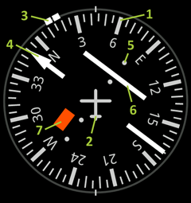

Horizontal Situation Indicator
==============================

The horizontal situation indicator (commonly called the HSI) is an aircraft instrument that combines both the Direction and the Course Deviation Indicator display. It is one of the main instruments for navigation.

Application provides simplified look-alike HSI:

1. Compass card displays your current [track](../Terms.html)
2. Symbolic aircraft together with lumber lines at top and bottom is used to reference your direction
3. Heading bug shows [bearing](../Terms.html) to active waypoint (your desired track)
4. Course pointer shows active [course](../Terms.html) when navigating in route mode
5. Course deviation scale is used to determine your deviation from course, each circle equals to three proximity values (configurable in preferences)
6. Course deviation bar shows your deviation from course, if the bar is to the right of course pointer than you have deviated left from course and vice versa.
7. Warning lag is red when there is no active navigation in place and orange when you are navigating to waypoint (course indicators are off)
